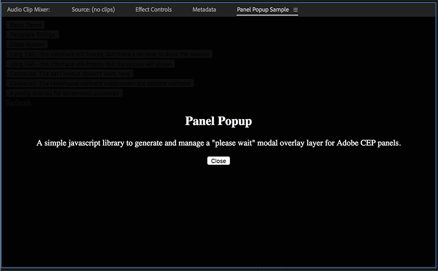

# Panel Popup

This is a library that generates and manages a "please wait" modal overlay layer on an HTML page. While not exclusively compatibile with [Adobe CEP panels](https://github.com/Adobe-CEP), that is the intended use case.

When executing extendscript from a CEP panel, [the UI freezes](https://forums.adobe.com/thread/2441258), so it makes sense to give the user some sort of message that the application is working. Unfortunately animated spinners don't work (because of the UI blocking), so a modal overlay seems to be the best bet.

This repository consists of the [source files](Files/) for the overlay as well as a [sample CEP panel](PanelPopupSample/) that runs through some of the features of the library.

*Note: I pretty much exclusively work in Premiere and that's what I've used this library with the most (and also where I've tested the sample project the most). The sample should work across all the Creative Cloud apps, but if you run into any issues, try opening the panel in Premiere.*



## Installation

Installation is simple. Copy the following files into your panel folder. You'll find them in the [Files](Files/) folder. In the sample panel, the .js file can be found in a [lib](PanelPopupSample/lib) folder and the .css file in a [css](PanelPopupSample/css) folder.

* [panel-popup.js](Files/panel-popup.js)
* [panel-popup.css](Files/panel-popup.css)

In your index.html file, just link to these files.

```html
<link href="css/panel-popup.css" rel="stylesheet" type="text/css">
<script src="lib/panel-popup.js"></script>
```

To install the sample panel, follow the directions on the [Adobe Premiere sample panel GitHub repository](https://github.com/Adobe-CEP/Samples/tree/master/PProPanel). Pay special attention to the directions for how to enable an unsigned panel. Note that these instructions are for CEP 8. If your Creative Cloud app is using an earlier CEP version, you'll need to enable that CEP version too.

For easy debugging and added flexibility, I usually create a symbolic link from my working panel directory (usually a Dropbox folder) to my CEP extensions folder. I have no idea how to do that on a Windows machine, but on a Mac, that looks like this (this will prompt you for your password and you'll need admin privileges on your machine):
```shell
sudo ln -s "[PATH TO WORKING FOLDER]" "/Library/Application Support/Adobe/CEP/extensions/"
```

## Usage

### Basic Features

At its most basic level, you can just initalize and then display a new `PanelPopup` object:
```javascript
var myPopup = new PanelPopup();
myPopup.showPopup();
```

You can optionally supply a message that you wish to appear (HTML formatted), or let the popup show the default message.
You can specify that message either when initializing the popup or when you're showing it.
```javascript
var myPopup = new PanelPopup("<h2>Doing something</h2><p>This may take a while for large projects</p>");
myPopup.showPopup("<h2>You can specify here instead</h2><p>This will overwrite the message you set in the constructor</p>");
```

From personal experience, if you show the popup and then call `csInterface.evalScript` on the next line, the UI will freeze before the popup has a chance to draw, which kind of defeats the whole purpose of this thing. So I recommend doing something like the following, where you show the popup and then use a timer to slightly delay the evalScript call:
```javascript
myPopup.show();
var delay = setTimeout(function (){
    csInterface.evalScript('Do something here')
}, 100);
```
**Tip:** With trial and error, I've found that about 50 milliseconds is a long enough delay but less than that is not. I've been doing 100 milliseconds just to be safe. If someone encounters a situation where even 100 isn't enough, first of all, get a faster computer! But second, shoot me an email or file a [bug report](https://github.com/dheidelberger/panel-popup/issues) and let know and I'll increase the delay.


To hide the popup, use the `hidePopup` method. You will likely want to declare `myPopup` as a global variable so that you can call its methods from anywhere in your panel code.
```javascript
myPopup.hidePopup();
```

So a complete basic use scenario looks something like this:
```javascript
var myPopup;

function initActionHere() {
    myPopup = new PanelPopup("<h2>Working very hard</h2><p>This may take a while for large projects</p>");
    var delay = setTimeout(function (){
        csInterface.evalScript('Do something here', finishedAction)
    }, 100);

}

function finishedAction() {
    myPopup.hidePopup();
}

```

### Advanced Features

###### Template Strings

You can also include template strings in curly braces:
```javascript
var myPopup = new PanelPopup("<h2>Doing {something}</h2><p>This may take {duration} for large projects</p>");
```

Later, when you call the `showPopup` method, you can pass an `options` object that tells the panel how to handle the template string:
```javascript
myPopup.showPopup({
    templateKeys: {
        something: "a very difficult job",
        duration: "twenty minutes"
    }
});
```

###### Options

You can also pass a `callback` in the `options` object that will get called after the popup closes. See the example project for more information about the callback and a few caveats for dealing with javascript scope issues.
```javascript
myPopup.showPopup({
    templateKeys: {
        something: "a very difficult job",
        duration: "twenty minutes"
    },
    callback: myCallback
});
```

The `options` object also lets you specify that you'd like a close button and to optionally specify the caption on the button. Remember, though, that when extendscript is executing, the user interface is frozen, so the user won't be able to press the close button until the extendscript is done executing.
```javascript
myPopup.showPopup({
    templateKeys: {
        something: "a very difficult job",
        duration: "twenty minutes"
    },
    callback: myCallback,
    closeButton: true,
    closeCaption: "Mr. Gorbachev tear down this popup"

});
```

###### Callbacks

In addition to specifying a callback in the `options` object, you can pass a callback as an argument to the `hidePopup` method. It's hard to see why you'd want to, but it's there if you need it. If you've already set a callback when you called `showPopup,` passing a callback to `hidePopup` will overwrite it.

###### Styling

The styling is very basic and easy to customize. You can look at the [panel-popup.css](Files/panel-popup.css) file to see what gets styled. There are some comments in there to get you started. To customize the look of the popup, the safest option is to create your own stylesheet that overrides some of the default styles. The sample project has a [custom stylesheet](PanelPopupSample/css/panel-popup-custom.css) that can be toggled on and off to give you an idea of how to do this.

A quick note about fonts. I set the `font-family` to be `Arial, Helvetica, sans-serif` because I think it looks nicer than the default panel font. Other than that, I've tried to mostly stay out of your way when it comes to styling the text because I'm assuming you're working with some sort of style template already. You can disable my font choice and let your style supercede mine if you set the `.popup-container` `font-family` to `inherit` in your custom css file (just be sure it gets loaded after `panel-popup.css`). I've implemented this in the [custom stylesheet](PanelPopupSample/css/panel-popup-custom.css) in the sample so you can see how it's done. In the future, I may also try to implement some sort of optional [Bootstrap](https://getbootstrap.com/) integration to add Bootstrap classes to the button in particular. Still thinking about that one.

###### More Information

The [index.js](PanelPopupSample/lib/index.js) file in the sample panel is heavily commented and shows a number of different ways of creating a popup as well as some of the pitfalls to avoid. The complete API is  also documented below.

## Full Documentation
<a name="PanelPopup"></a>

### PanelPopup

* [PanelPopup](#PanelPopup)
    * [new PanelPopup([content])](#new_PanelPopup_new)
    * [.setContent(content)](#PanelPopup+setContent)
    * [.showPopup()](#PanelPopup+showPopup)
    * [.showPopup(content)](#PanelPopup+showPopup)
    * [.showPopup(options)](#PanelPopup+showPopup)
    * [.showPopup(content, options)](#PanelPopup+showPopup)
    * [.hidePopup([callback])](#PanelPopup+hidePopup)

<a name="new_PanelPopup_new"></a>

#### new PanelPopup([content])
The PanelPopup object creates and manages an overlay popup.


| Param | Type | Description |
| --- | --- | --- |
| [content] | <code>string</code> | The text content of the overlay. Should be HTML formatted. You can also include basic template strings by enclosing text in {}. |

<a name="PanelPopup+setContent"></a>

#### panelPopup.setContent(content)
Method to change the contents of the overlay after its been initialized but before it's been displayed. Probably not something you'll use very often, if ever, but there if you need it.


| Param | Type | Description |
| --- | --- | --- |
| content | <code>string</code> | The new overlay contents. Should be HTML formatted. Like the constructor, you can also include template strings with {}. |

<a name="PanelPopup+showPopup"></a>

#### panelPopup.showPopup()
Show the popup

<a name="PanelPopup+showPopup"></a>

#### panelPopup.showPopup(content)
Set the popup contents and then display it.


| Param | Type | Description |
| --- | --- | --- |
| content | <code>string</code> | The text content of the overlay. Should be HTML formatted. While you can, in theory, include basic template strings by enclosing text in {}, there isn't really a point as there's no place for you to set the replacements. |

<a name="PanelPopup+showPopup"></a>

#### panelPopup.showPopup(options)
Set some display options for the popup and then display it.


| Param | Type | Description |
| --- | --- | --- |
| options | [<code>options</code>](#options) | Specialized options for the popup. None are required. |

<a name="PanelPopup+showPopup"></a>

#### panelPopup.showPopup(content, options)
Set the contents and some display options for the popup and then display it.


| Param | Type | Description |
| --- | --- | --- |
| content | <code>string</code> | The text content of the overlay. Should be HTML formatted. |
| options | [<code>options</code>](#options) | Specialized options for the popup. None are required. |

<a name="PanelPopup+hidePopup"></a>

#### panelPopup.hidePopup([callback])
Hide the popup.


| Param | Type | Description |
| --- | --- | --- |
| [callback] | <code>function</code> | Optional callback. If you've already set a callback when you called showPopup, this callback will replace that one. |

<a name="options"></a>

### options : <code>Object</code>
Options object that can be passed to set advanced features of the overlay including template strings. All of the properties are optional. Once these properties are set, they're set for the life of the PanelPopup, meaning, if you call showPopup more than once, it will remember the settings from the first call when you make the second call. You can re-initialize the PanelPopup to reset the options.

**Properties**

| Name | Type | Default | Description |
| --- | --- | --- | --- |
| [templateKeys] | <code>object</code> |  | Object with key/value pairs to replace template strings in the overlay's contents. The keys should match the template strings. Note that the overlay will only replace the keys that it finds in this object. So if there's a template string in your contents and you don't include a replacement for it in the templateKeys object, it won't get replaced. |
| [closeButton] | <code>boolean</code> |  | If you want to include a close button, set this to true. |
| [closeCaption] | <code>string</code> | <code>&quot;Close&quot;</code> | The caption you want to appear on the close button. Defaults to "Close" |
| [callback] | <code>function</code> |  | Callback for when the overlay has been hidden. Can also be set when calling the hidePopup method. |

## Contributing

1. Fork it!
2. Create your feature branch: `git checkout -b my-new-feature`
3. Commit your changes: `git commit -am 'Add some feature'`
4. Push to the branch: `git push origin my-new-feature`
5. Submit a pull request :D

## History

Initial release, v1.0.0

## Credits

Written by David Heidelberger. I'm a full-time video editor and producer and part-time software developer. I'm available for workflow consultation and custom software solutions for your post-production workflow. To get in touch about a consult, or just to tell me how you're using the library, I'd love to [hear from you](mailto:david.heidelberger@gmail.com).

## License

Panel Popup is released under an MIT license.

Copyright 2018 David Heidelbeger

Permission is hereby granted, free of charge, to any person obtaining a copy of this software and associated documentation files (the "Software"), to deal in the Software without restriction, including without limitation the rights to use, copy, modify, merge, publish, distribute, sublicense, and/or sell copies of the Software, and to permit persons to whom the Software is furnished to do so, subject to the following conditions:

The above copyright notice and this permission notice shall be included in all copies or substantial portions of the Software.

THE SOFTWARE IS PROVIDED "AS IS", WITHOUT WARRANTY OF ANY KIND, EXPRESS OR IMPLIED, INCLUDING BUT NOT LIMITED TO THE WARRANTIES OF MERCHANTABILITY, FITNESS FOR A PARTICULAR PURPOSE AND NONINFRINGEMENT. IN NO EVENT SHALL THE AUTHORS OR COPYRIGHT HOLDERS BE LIABLE FOR ANY CLAIM, DAMAGES OR OTHER LIABILITY, WHETHER IN AN ACTION OF CONTRACT, TORT OR OTHERWISE, ARISING FROM, OUT OF OR IN CONNECTION WITH THE SOFTWARE OR THE USE OR OTHER DEALINGS IN THE SOFTWARE.
